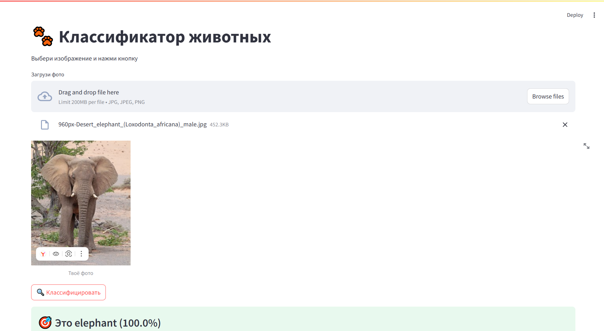

# 🐾 Классификатор животных

[](https://www.python.org/)
[](https://www.tensorflow.org/)
[]()
[](https://fastapi.tiangolo.com/)
[](https://streamlit.io/)

Сравнительный анализ моделей глубокого обучения для классификации изображений животных (кошка, собака, слон, лошадь, лев).



## 📊 Сравнение моделей

| Модель | Accuracy | Precision | Recall | F1-Score |
|--------|----------|-----------|--------|----------|
| Dense | 0.70 | 0.70 | 0.70 | 0.70 |
| SimpleCNN | 0.87 | 0.87 | 0.87 | 0.87 |
| **VGGCNN** | **0.88** | **0.88** | **0.88** | **0.88** |

**Лучшая модель:** VGGCNN (VGG-подобная сверточная сеть)

## 📁 Структура проекта

```
├── best_classification_model.h5   # Обученная модель
├── model_config.pkl               # Конфигурация (классы, размер)
├── app.py                         # Streamlit-приложение
├── requirements.txt               # Зависимости
├── Практическая_работа_№10.ipynb # Ноутбук с анализом
└── README.md                      # Документация
```

## 🚀 Локальный запуск

### Установка

```bash
git clone https://github.com/DenisDrobyshev/classification_animals.git
cd classification_animals
pip install -r requirements.txt
```

### Запуск Streamlit

```bash
streamlit run app.py
```

### Запуск API (FastAPI)

```bash
uvicorn main:app --reload
```

## 📝 Описание датасета

Датасет содержит изображения 5 классов животных:
- Cat (кошка)
- Dog (собака)  
- Elephant (слон)
- Horse (лошадь)
- Lion (лев)

Каждый класс содержит ~2700 изображений для обучения и ~300 для валидации.

## 🧠 Архитектуры моделей

1. **Dense** — полносвязная нейронная сеть (1024→512→256→5)
2. **SimpleCNN** — сверточная сеть (3 блока Conv2D + MaxPooling)
3. **VGGCNN** — VGG-подобная архитектура (4 блока, до 512 фильтров)

## 📈 Результаты

VGGCNN показала наилучшие результаты по всем метрикам. Полносвязная модель значительно уступает сверточным, что ожидаемо для задачи классификации изображений.

## 🔗 Ссылки

- **Репозиторий:** https://github.com/DenisDrobyshev/classification_animals
- **API (локально):** http://localhost:8000
- **Streamlit (локально):** http://localhost:8501

